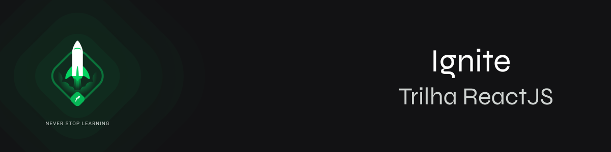

<h2 align="center">
  Ignite ReactJS
</h2>

  <a href="#Sobre">Sobre</a>&nbsp;&nbsp;&nbsp;|&nbsp;&nbsp;&nbsp;
  <a href="#Desafios">Desafios</a>&nbsp;&nbsp;&nbsp;&nbsp;&nbsp;&nbsp;

## Sobre
O Ignite é um programa feito pela [Rocketseat](https://rocketseat.com.br) de aceleração para devs, focado em preparar profissionais completos(as) para o mercado, treinando skills técnicas e comportamentais de forma intensiva e prática. O Ignite é dividido em trilhas de conhecimento não-dependentes onde nos aprofundamos em uma tecnologia específica. Em resumo, o objetivo do Ignite é desenvolver habilidades que vão acelerar sua carreira através de uma metodologia de aprendizado eficiente, um currículo alinhado às necessidades do mercado e as atitudes que vão te ajudar a se destacar como profissional.

## Desafios

**Semana 1 - Fundamentos do ReactJS**

  Nesse semana criaremos a estrutura base de uma aplicação React utilizando ferramentas como Webpack, Babel, Webpack Dev server, SASS, Source Maps, Fast Refresh e descobriremos conceitos importantes do React como componentes, propriedades, estados e hooks além de aplicar o TypeScript no nosso projeto para adicionar tipagem estática à aplicação.

- [01 - Conceitos do React](https://github.com/georgaugusto/ignite-react-js)
- [02 - Componentizando a aplicação](https://github.com/georgaugusto/ignite-react-js)

**Semana 2**

  Nesse semana criaremos a estrutura base de uma aplicação React utilizando ferramentas como Webpack, Babel, Webpack Dev server, SASS, Source Maps, Fast Refresh e descobriremos conceitos importantes do React como componentes, propriedades, estados e hooks além de aplicar o TypeScript no nosso projeto para adicionar tipagem estática à aplicação.

- [01 - Criando um hook de carrinho de compras](https://github.com/georgaugusto/ignite-react-js)
- [02 - Refactoring de classes e typescript](https://github.com/georgaugusto/ignite-react-js)
